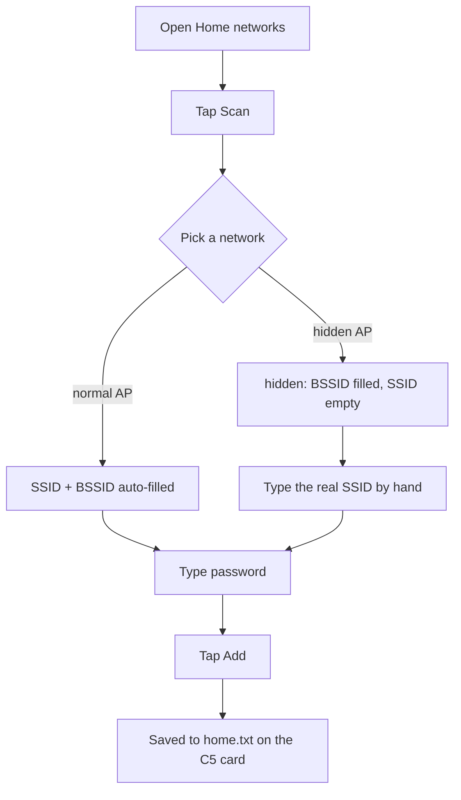
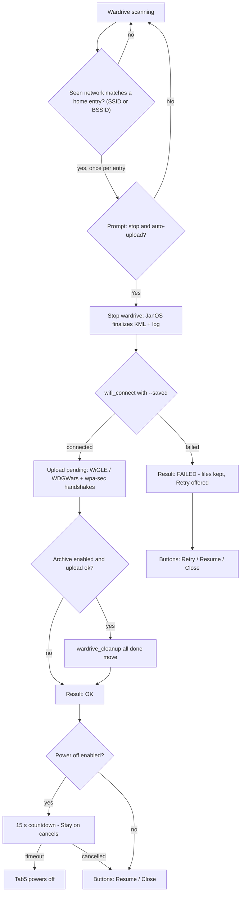

# Wardrive Auto‑Upload & Home Networks

Automatically upload wardrive data when you come home. While a wardrive scan is
running, if a network you flagged as "home" comes into range, the Tab5 offers a
one‑tap confirmation to stop scanning, connect using the saved password, and
upload the pending logs (WiGLE / WDGWars) plus handshakes (wpa‑sec) — optionally
archiving the uploaded files afterwards.

> **Firmware:** the home‑network commands live in **JanOS (ESP32‑C5)**. The C5
> must be flashed with a build that includes `home_add` / `home_remove` /
> `home_list`. On older firmware the Tab5 shows *"JanOS firmware too old"* and
> the `home` dashboard chip stays red.

---

## 1. `home.txt` file format

Home networks are stored on the **C5 SD card** at:

```
/sdcard/lab/home.txt
```

It is the single source of truth (there is **no** NVS copy). Each line is one
network in a **quoted CSV** format — the same convention as `eviltwin.txt`:

```
"SSID", "password", "BSSID"
```

- Fields are wrapped in double quotes and separated by `, ` (comma + space).
- **Quotes are required.** Do **not** use a colon‑separated form like
  `ssid:pass:bssid` — it will be ignored (the BSSID and passwords can contain
  colons, which is exactly why quoting is used).
- The **`BSSID` field is optional.** A two‑field line is valid.
- `SSID` — the **real** network name (max 32 chars). Spaces and colons are fine.
- `password` — WPA/WPA2/WPA3 passphrase (max 64 chars).
- `BSSID` — AP MAC as `AA:BB:CC:DD:EE:FF`. Used to match **hidden** networks
  (see §4). Case is ignored when matching.

### Examples

```
"HomeNet", "s3cr3tpass", "AA:BB:CC:DD:EE:FF"
"Home WiFi 5G", "anotherpass123"
"Net with, a comma", "pass", "12:34:56:78:9A:BC"
```

> **Prefer the GUI over hand‑editing** (see §3). The app writes this file for you
> in the correct format. Hand‑editing is a fallback only.

---

## 2. Arming auto‑upload

**Wardrive → ⚙ Setup → "Auto‑upload (home networks)"** section:

| Control        | Meaning                                                        |
|----------------|----------------------------------------------------------------|
| **Auto upload on home network** | Master toggle for the whole feature.          |
| **WiGLE**      | Upload pending wardrive logs to WiGLE.                          |
| **WDGWars**    | Upload pending wardrive logs to WDGWars.                        |
| **Archive**    | After a successful upload, archive the uploaded ("done") files. |
| **Power off**  | Power off the Tab5 after a successful upload (skipped on failure; a 15 s countdown lets you cancel). |

Settings persist in NVS on the Tab5 (namespace `settings`, keys `wd_au_*`).
**wpa‑sec** handshakes are uploaded **only if handshakes are actually present**
(`/sdcard/lab/handshakes/*.pcap`) — otherwise the wpa‑sec step is skipped. Handshake
upload is independent of wardrive; it just piggybacks on the same connection.

The Setup screen (and *Home networks…*) is only available **while the wardrive is
not scanning** — the radio can only do one thing at a time.

---

## 3. Managing home networks (GUI)

**Wardrive → ⚙ Setup → 🏠 Home networks…**

- Lists current entries; hidden‑SSID entries also show `[BSSID]`.
- **Add / update:** type **SSID**, **Password**, and optionally **BSSID**, then
  tap **Add**. An existing SSID is updated in place.
- **Delete:** tap the 🗑 button on a row.
- **Scan:** tap **📶 Scan** to list nearby APs, then tap one to auto‑fill its
  **SSID** and **BSSID** into the inputs — then just type the password and **Add**.

### Adding a hidden network

A hidden AP appears in the scan as **`(hidden)`** with a BSSID. Tap it: the BSSID
is filled and the SSID is left empty. **Type the real SSID by hand**, enter the
password, and **Add**. Both parts are needed and play different roles:

- **SSID (typed)** — used to *connect* (`wifi_connect` needs the name).
- **BSSID (from scan)** — used to *detect* the AP during wardrive (its on‑air SSID
  is empty).

The typed SSID must be exact — if it's wrong the prompt still appears (matched by
BSSID) but the connect fails.



Under the hood these drive the JanOS commands:

```
home_add "<SSID>" "<password>" [BSSID]
home_remove "<SSID>"
home_list                       # prints:  N "SSID" "BSSID"
```

The **dashboard `home` chip** (bottom of the start screen, right column) shows
green when `home.txt` exists on the active tab's card, red otherwise. It refreshes
with the other `/lab` file chips.

---

## 4. How matching works (incl. hidden SSIDs)

At scan start the Tab5 pulls `home_list` once and caches the SSID+BSSID set.
For every network reported by the wardrive stream it checks:

- **SSID match** — the streamed SSID equals a stored SSID, **or**
- **BSSID match** — the streamed BSSID equals a stored BSSID (case‑insensitive).

A **hidden network** broadcasts an empty SSID in the stream, so SSID matching
can't work — that's what the **BSSID** field is for. When matched by BSSID, the
connection still uses the **stored (real) SSID**, because you must know the name
to associate with a hidden AP.

Each entry prompts **once per scan session**. Tapping *No* (or a failed run)
won't re‑ask for that entry until you stop and start the wardrive again.

### Finding a hidden network's BSSID

- **Easiest:** use **📶 Scan** in the *Home networks…* screen (§3) and tap the
  `(hidden)` entry — the BSSID is filled for you.
- Or run `scan_networks` on the C5 — hidden APs appear with their BSSID and an
  empty SSID.
- Or read it from your router's admin page.

---

## 5. The auto‑upload flow

When the prompt *"Home network detected — stop wardrive and auto‑upload now?"*
appears and you tap **Yes**:

1. **Stop** the promiscuous wardrive (JanOS finalizes the KML + closes the log).
2. **Connect** via `wifi_connect "<SSID>" --saved` (JanOS reads the password from
   `home.txt`).
3. Upload **pending** files only:
   - WiGLE → `wigle_upload`, WDGWars → `wdgwars_upload` (no `all`).
   - wpa‑sec handshakes → `wpasec_upload`, **only when** `/sdcard/lab/handshakes`
     contains at least one `.pcap` (skipped otherwise).
4. If **Archive** is enabled and the upload succeeded →
   `wardrive_cleanup all done move <timestamp>`.
5. Show the result with **Resume** (restart the wardrive) / **Close** buttons.
   On failure the files are kept and a **Retry** button is offered.
6. If **Power off** is enabled and the upload succeeded, the Tab5 counts down from
   **15 s** and then powers off (`bsp_generate_poweroff_signal`). A **Stay on**
   button cancels the countdown — you land on the normal result screen
   (*Resume* / *Close*) and the device stays up. Power off is skipped entirely on
   failure, so a failed run always leaves you with **Retry**.

Requirements for a real upload: a WiGLE/WDGWars key on the C5
(`/lab/wigle.txt`, `/lab/wdgwars.txt`) and at least one **pending** file.
Missing key → that provider is skipped (not fatal).



---

## 6. Related robustness features

### Low‑battery graceful stop
While a wardrive runs, the Tab5 checks the battery every ~10 s. At **≤ 8 %**
(sustained for two reads) it sends `stop` so JanOS can cleanly finalize the KML
and close the log before a hard power‑off would truncate them.

### Trace‑KML repair
A trace KML left unclosed by a power‑loss (missing
`</Placemark></Folder></Document></kml>`) won't open in Google Earth. JanOS fixes
these:

- **Automatically** at the start of every wardrive session, for any leftover
  `*_track.inprogress.kml`.
- **On demand:** `wardrive_fix_kml <file>` — closes the document at the last
  complete `</Placemark>` and publishes a valid `_track.kml`.

---

## 7. Command reference (JanOS / C5)

| Command | Purpose |
|---|---|
| `home_add "<SSID>" "<password>" [BSSID]` | Add or update a home network. |
| `home_remove "<SSID>"` | Remove a home network by SSID. |
| `home_list` | Print entries as `N "SSID" "BSSID"` (terminated by `Home networks printed`). |
| `wifi_connect "<SSID>" --saved` | Connect using a saved password (eviltwin / portals / **home.txt**). |
| `wardrive_fix_kml <file>` | Repair a truncated trace KML. |

---

## 8. Notes & limitations

- **Reflash the C5** to get the new `home_*` and `wardrive_fix_kml` commands.
- The **SD card must be mounted on the C5** — home passwords and uploads all need
  it. If the card is missing at scan start, `home_list` returns empty and
  auto‑upload simply never triggers (no crash).
- **API-key precheck:** at scan start the Tab5 runs `wigle_key read` / `wdgwars_key
  read`. If no armed provider has a key (`/lab/wigle.txt`, `/lab/wdgwars.txt`), the
  auto-upload trigger is **disabled for that session** (logged) — it won't stop the
  scan and connect just to upload nothing. Add the key and restart the wardrive.
- The promiscuous wardrive streams a network (and therefore fires the trigger)
  **only with a GPS fix** — you need a fix to test this.
- Auto‑upload interrupts the wardrive for the duration of the upload (single
  radio); that's why it is gated behind an explicit confirmation and limited to
  your home networks.
